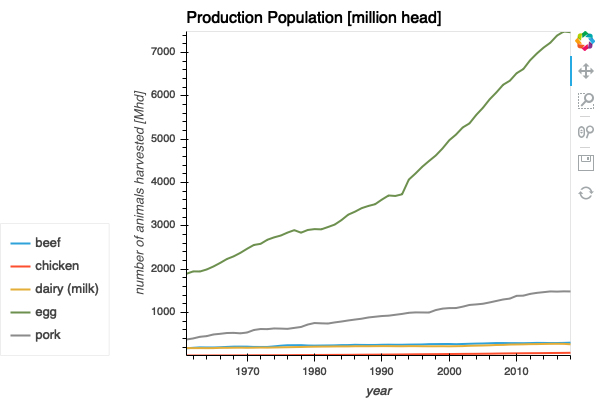
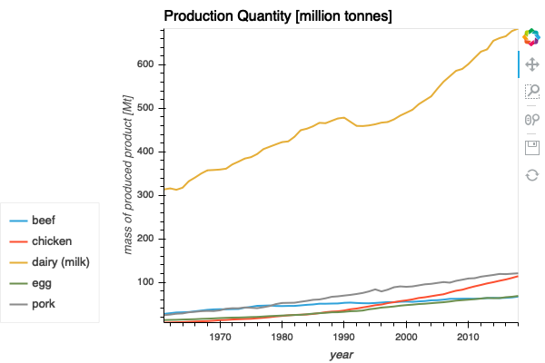

# FAOSTAT Animal Production Quantity and Population

## Description 
This dataset contains information about the mass of animal product produced and
the number of animals from which it was produced. It only considers swine,
poultry (layer and boiler), and cattle (beef and dairy). This data was formatted by
hand in excel from the datasets found in `source`. This data set covers years
from 1961 through 2018.

## Key Numbers
| Commodity | Mass Produced (Mt) | Producing Population (Mhd) |
| :--: | :--: | :--: | 
| Poultry, Eggs | ≈ 70 | ≈ 7000 |
| Poultry, Meat | ≈ 100 | ≈ 70 |
| Cattle, Dairy | ≈ 700 | ≈ 300 | 
| Cattle, Beef | ≈ 70 | ≈ 300 | 
| Swine, Pork | ≈ 120 | ≈ 1500 |

## Source Information
* **Source Website**:  Food and Agriculture Organization of the United Nations (FAO)
* **URL**: [http://www.fao.org/faostat/en/#data/QL](http://www.fao.org/faostat/en/#data/QL)
* **Original License**: [CC BY-NC-SA 3.0](https://creativecommons.org/licenses/by-nc-sa/3.0/)
* **Bias**: This is a data source operated and maintained by the United Nations.
  It is unlikely to have a strong bias in reporting. Their methods and
  annotations are also exceptionally well documented. These numbers, however,
  should be compared with other data sources and simple estimates.

## Notes 
The data set was downloaded from FAOSTAT and manually massaged into the tidy
form. Two versions of the data set were used, one of which measured the amount
of product made and another corresponding to the number of animals used to
produce the product. 

Note that in the original downloaded set, measurements for egg production was
given in units of 1000 units, meaning individual eggs. To convert to mass, we
approximated all eggs derived from chickens to have a mass of ≈ 50 g. 

## Key Figures

 

