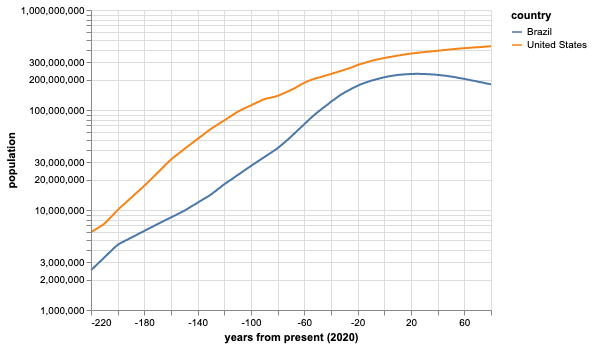

# World Population by Country from 1800 - 2100 (expected)

## Description 
This dataset comes from the Gapminder website and has population counts for each
country from 1800 to 2100.

## Source Information

* **Source Website**: Gapminder
* **URL**: `gapm.io/dpop`
* **Bias**: Not Annotated, likely no bias given nature of website

## Key Numbers
* This data set is diverse and does not have a single unique number associated
  with it.  Please see the full data set for more information

## Notes 
*The original data set was not in tidy format and had to be massaged.*

This data set from Gapminder shows *estimates* of the global population at
country-level resolution for the years 1800 up through 2100. They use UN
population data between 1950 and 2100 using their median fertility to estimate
population. Small discrepancies were present in the data between estimated
population and true populations in 1950. Corrections were applied to make sure
they agreed. It is not immediately clear how this correction was applied, but
they provide the code used to generate the estimates [here](https://drive.google.com/open?id=1BXTC5qLiEYpPzcr-XwpBUH_UK8m-xToh)

Below are two plots that show how population has changed in Brazil and the US.

 